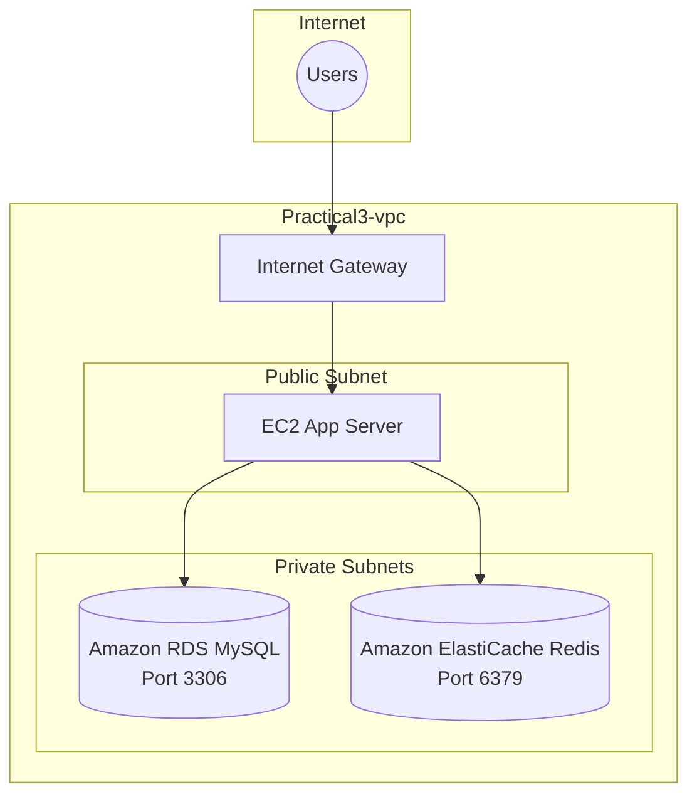

# Practical 3 - Side-Cache Pattern Using Amazon ElastiCache (Redis) with RDS (MySQL)

## Student Information
- **Name:** Ashish Gaikar
- **PRN:** 202301040070
- **Topic:** Implementing Side-Cache Pattern to reduce RDS load using Amazon ElastiCache (Redis)

---

## Problem Statement
A high-traffic e-commerce platform stores its **Product Catalog** in an Amazon RDS (MySQL) instance.During peak hours, the database CPU spikes because every single page load triggers a heavy `SELECT` query to fetch product details, pricing, and descriptions.

The goal is to implement a **Side-Cache (Lazy Loading) pattern** using **Amazon ElastiCache (Redis)** to:
- Reduce the load on RDS.
- Decrease page load times from hundreds of milliseconds to **sub-10 milliseconds** for cached items.

---

## Architecture Overview



### How the Side-Cache (Lazy Loading) Pattern Works
1. App server **checks Redis first** for the requested product[cite: 6].
2. If found → **Cache HIT** → returns data instantly (sub-10ms)[cite: 4].
3. If not found → **Cache MISS** → queries RDS MySQL[cite: 6].
4. After fetching from RDS → **backfills Redis** with a TTL (Time To Live)[cite: 6, 7].
5. Next request for same product → served from Redis.


---

## Implementation Steps

### Step 1 — VPC & Subnet Creation
A custom VPC named `Practical3-vpc` was created with CIDR block `10.0.0.0/16`. Four subnets were created across two Availability Zones for high availability.


*Caption: Create VPC page showing name Practical3-vpc and CIDR 10.0.0.0/16.*


*Caption: Overview showing the 4 subnets successfully created and listed in the VPC dashboard.*

---

### Step 2 — Internet Gateway & Routing
An Internet Gateway named `practical3-IGW` was created and attached to the VPC. Route tables were configured to direct public traffic to the gateway while keeping the private tier isolated.


*Caption: practical3-IGW successfully attached to Practical3-vpc.*


*Caption: Adding route 0.0.0.0/0 → Internet Gateway to the public-RT.*


*Caption: Associating private-subnet-1 and private-subnet-2 with the private-RT.*

---

### Step 3 — Security Groups (Principle of Least Privilege)
Security groups were orchestrated to ensure that RDS and Redis only accept traffic from the App Server[cite: 6].


*Caption: sg-rds inbound rules showing port 3306 restricted to the sg-app-server.*


*Caption: sg-redis inbound rules showing port 6379 restricted to the sg-app-server.*

---

### Step 4 — Database & Cache Provisioning
Amazon RDS and ElastiCache were provisioned in private subnets with encryption enabled and no public access[cite: 6].


*Caption: RDS connectivity settings showing private subnet group and Public access: No.*


*Caption: RDS instance "product-catalog-db" in Available state.*


*Caption: Redis cluster successfully provisioned and Available.*

---

### Step 5 — Application & Lazy Loading Logic
The EC2 App Server hosts the caching logic. The implementation follows the "Check-Fetch-Backfill" workflow[cite: 6].

#### **A. Database Initialization (`setup_db.py`)**
A Python script was executed to connect to the RDS endpoint, create the `products` table, and populate it with initial e-commerce sample data.


*Caption: Python implementation of the RDS database schema and data insertion logic.*

#### **B. Verifying RDS Data**
Once the setup script was completed, a direct connection was established to the RDS MySQL instance via the command line to confirm the table was successfully populated.


*Caption: Confirming the product catalog contents within the RDS instance via the MySQL monitor.*

---

#### **C. Side-Cache Implementation (`cache_app.py`)**
The core logic for the Side-Cache pattern was implemented using the `pymysql` and `redis` Python libraries. The script first checks the Redis cache and only queries RDS upon a cache miss, subsequently backfilling the cache with a 300-second TTL to maintain data freshness[cite: 6, 7].

```python
import pymysql
import redis
import json
import time

# ---- Configuration ----
RDS_CONFIG = {
    "host": "your-rds-endpoint.rds.amazonaws.com",
    "database": "productcatalog",
    "user": "admin",
    "password": "your-password",
    "port": 3306,
    "cursorclass": pymysql.cursors.DictCursor
}

REDIS_HOST = "your-elasticache-endpoint.cache.amazonaws.com"
REDIS_PORT = 6379
CACHE_TTL = 300  # 5 minutes — prevents stale data

# ---- Connect to Redis ----
cache = redis.Redis(host=REDIS_HOST, port=REDIS_PORT, decode_responses=True)

# ---- Connect to RDS ----
def get_db_connection():
    return pymysql.connect(**RDS_CONFIG)

# ---- Core Lazy Loading / Side-Cache Function ----
def get_product(product_id):
    cache_key = f"product:{product_id}"

    # STEP 1: Check Redis FIRST
    cached_data = cache.get(cache_key)

    if cached_data:
        print(f"  [CACHE HIT] ✅ Product {product_id} served from Redis")
        return json.loads(cached_data)

    # STEP 2: Cache MISS — go to RDS
    print(f"  [CACHE MISS] ❌ Product {product_id} not in Redis, querying RDS...")
    conn = get_db_connection()
    cur = conn.cursor()
    cur.execute(
        "SELECT id, name, description, price FROM products WHERE id = %s",
        (product_id,)
    )
    row = cur.fetchone()
    cur.close()
    conn.close()

    if row is None:
        return None

    product = {
        "id": row["id"],
        "name": row["name"],
        "description": row["description"],
        "price": float(row["price"])
    }

    # STEP 3: Backfill Redis with TTL
    cache.setex(cache_key, CACHE_TTL, json.dumps(product))
    print(f"  [CACHE SET] 💾 Product {product_id} stored in Redis (TTL={CACHE_TTL}s)")

    return product
```
### Step 6 — Results & TTL Verification
The implementation successfully reduced response times to **sub-1ms**. A TTL was verified to ensure cache consistency[cite: 4, 7].


*Caption: Terminal output showing CACHE MISS (33.32 ms) followed by CACHE HIT (0.55 ms).*


*Caption: Verifying active TTL (292s remaining) for cached product data.*


*Caption: Confirmation of automatic cache invalidation once TTL reaches zero.*

---

## Results Summary
| Request | Source | Time Taken |
|---|---|---|
| Request #1 (Cache MISS) | RDS MySQL | ~33.32 ms |
| Request #2 (Cache HIT) | Redis | **~0.55 ms** ✅ |

---
